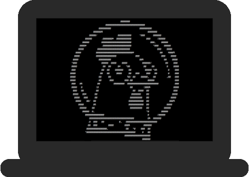

# Huhnitor

  
   
  An intergalactic serial monitor for the <a href="https://github.com/SpacehuhnTech/esp8266_deauther">ESP8266 Deauther</a>
   
  

## Usage

The Huhnitor is designed to be as easy to use as possible:  

1. Download the latest [release](https://github.com/SpacehuhnTech/Huhnitor/releases) for your operating system
2. Run it
3. Plug in your deauther
4. Have fun using the command line interface of the [ESP8266 Deauther](https://github.com/SpacehuhnTech/esp8266_deauther) :slightly_smiling_face:

## Drivers

Your deauther is not detected when plugged in? 
Depending on the serial chip that is used on the ESP8266 development board you have, you might need to install the right driver:  

* [CP210x](https://www.silabs.com/products/development-tools/software/usb-to-uart-bridge-vcp-drivers)
* [CH341](http://www.wch-ic.com/search?q=cH341&t=downloads)
* [FTDI](https://www.ftdichip.com/FTDrivers.htm)

Not sure which one to install? A lot of ESP8266 based development boards use a chip from the CP210x family, try starting there.   

## Compiling

Precompiled binaries can be found at [releases](https://github.com/SpacehuhnTech/Huhnitor/releases).  
But if you want, you can compile the Huhnitor yourself:  

1. Install Rust using [rustup](https://www.rust-lang.org/tools/install)
2. [Download and unzip](https://github.com/SpacehuhnTech/Huhnitor/archive/master.zip) or `git clone https://github.com/SpacehuhnTech/Huhnitor.git` this repository
3. In the root directory of the repo run `cargo build --release`, your binary will be located in `target/release/`

## Credits

Made with :heart: by [Jamz](https://github.com/the-Jamz) with help from [Selicre](https://selic.re) 
in cooperation with [Spacehuhn Technologies](https://github.com/SpacehuhnTech/)

## License

This software is licensed under the MIT License. See the [license file](LICENSE) for details.  
